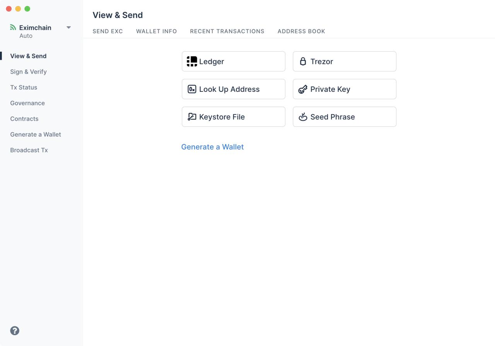
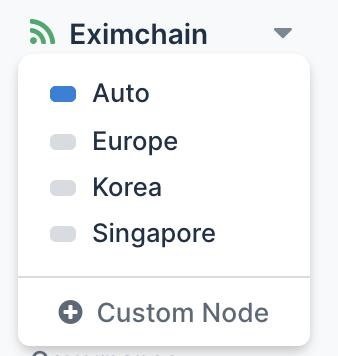
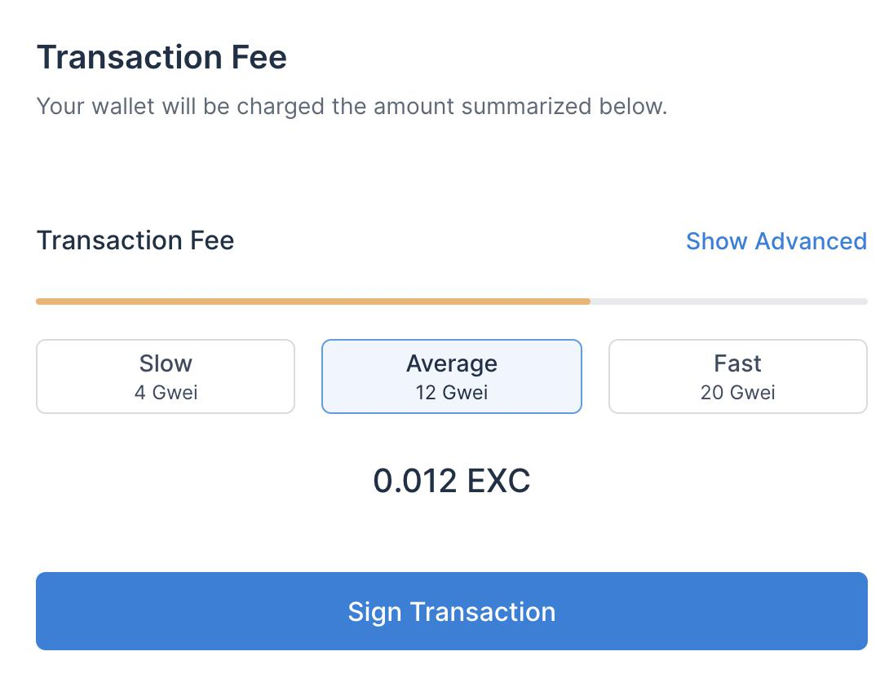
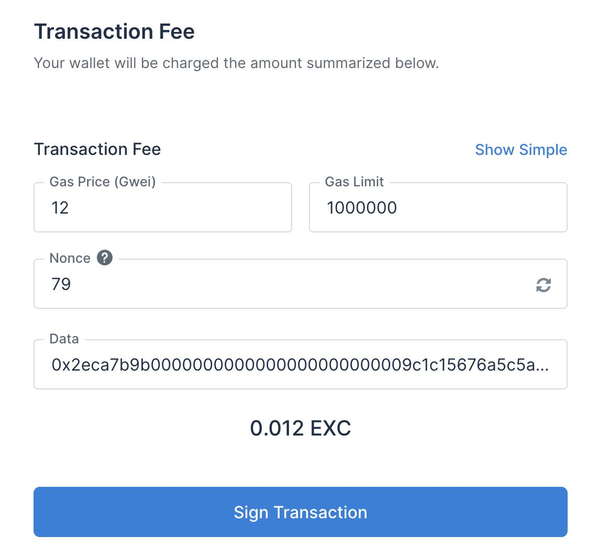
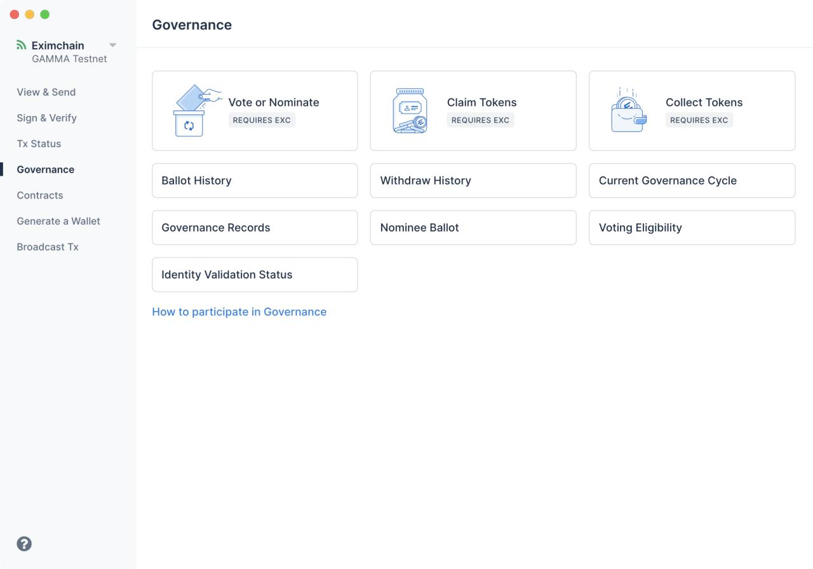

# Eximchain Wallet

Eximchain wallet is a desktop wallet client that connects to the Eximchain network. We are currently still in beta, so if you see any issues, please report them to [support@eximchain.com](mailto:support@eximchain.com)

## [**⬇︎ Download the latest release**](https://github.com/Eximchain/EximchainWallet/releases)

Table of Contents
=================

* [Overview](#overview)
* [Requirements](#requirements)
* [Running the App](#running-the-app)
    * [Development](#development)
      * [Handling HTTPS](#handling-https)
    * [Build Releases](#build-releases)
    * [Signing Releases](#signing-releases)
    * [Address Derivation Checker:](#address-derivation-checker)
      * [The derivation checker utility assumes that you have:](#the-derivation-checker-utility-assumes-that-you-have)
      * [Docker setup instructions:](#docker-setup-instructions)
      * [Run Derivation Checker](#run-derivation-checker)
* [Folder structure:](#folder-structure)
* [Data Mangement](#data-mangement)
    * [App State(Data Structure)](#app-statedata-structure)
    * [config](#config)
    * [notifications](#notifications)
    * [onboarding](#onboarding)
    * [wallet](#wallet)
    * [deterministicWallets](#deterministicwallets)
    * [transaction](#transaction)
    * [transactions](#transactions)
    * [addressBook](#addressbook)
    * [gas](#gas)
    * [routing(uses react-router-redux)](#routinguses-react-router-redux)
* [Eximchain Governance Tab](#eximchain-governance-tab)
    * [Governance/Index.tsx](#governanceindextsx)
    * [CostlyContractCallScreen](#costlycontractcallscreen)
    * [FreeContractCallScreen](#freecontractcallscreen)
* [Changelog](#changelog)
    * [Refreshed UI/UX](#refreshed-uiux)
    * [Bug Patches/Fixes](#bug-patchesfixes)
    * [More information is available on the <a href="https://eximchain.zendesk.com/hc/en-us" rel="nofollow">Help Desk</a>](#more-information-is-available-on-the-help-desk)
      

Created by [gh-md-toc](https://github.com/ekalinin/github-markdown-toc)

## Overview
This wallet is a forked version of MyCryptoWallet with some modifications specific to our very own Eximchain Network. Notably, we have added a governance tab that is used for interacting with the governance smart contract of our network, aesthetic changes to be on brand, and some ui/ux modifications for easier usage.

## Requirements

* Node 8.9.4\*
* Yarn >= 1.7.0\*\*
* Python 2.7.X\*\*\*

<sub>\*Higher versions should work fine, but may cause inconsistencies. It's suggested you run 8.9.4 using `nvm`.</sub>
<br/>
<sub>**npm is NOT supported for package management. Eximchain Wallet uses yarn.lock to ensure sub-dependency versions are pinned, so yarn is required to install node_modules</sub>
<br/>
<sub>\***Python 3 is **not** supported, since our dependencies use `node-gyp`.</sub>

## Running the App

After `yarn`ing all dependencies you can run various commands depending on what you want to do:

### Development

```bash
# run app in dev mode in browser, rebuild on file changes
yarn dev
```

```bash
# run app in dev mode in electron, rebuild on file changes
yarn dev:electron
```

#### Handling HTTPS

Some parts of the site, such as the Ledger wallet, require an HTTPS environment to work. To develop on HTTPS, do the following:

1.  Create your own SSL Certificate (Heroku has a [nice guide here](https://devcenter.heroku.com/articles/ssl-certificate-self))
2.  Move the `.key` and `.crt` files into `webpack_config/server.*`
3.  Run the following command:

```bash
yarn dev:https
```

### Build Releases

```bash
# builds the production server app
yarn build
```

```bash
# builds the downloadable version of the site
yarn build:downloadable
```

```bash
# builds the electron apps
yarn build:electron

# builds only one OS's electron app
yarn build:electron:(osx|linux|windows)
```

All of these builds are output to a folder in `dist/`.

### Signing Releases
There are some issues still withstanding with trying to utilize electron-builder's signing. 
  - You can follow the steps outlined here(https://www.electron.build/code-signing).
  - However, after one successfuly run I have been unable to once again get code-signing to work. 
  - Windows signing is still not resolved.
  - Ideally we mimic the set up that MyCrypto already uses with jenkins to handle the signed releases
  - In the mean time I should work on getting something like a md5 checksum and update the hash in this readme so people can check they have the correct version. 


### Address Derivation Checker:

EthereumJS-Util previously contained a bug that would incorrectly derive addresses from private keys with a 1/128 probability of occurring. A summary of this issue can be found [here](https://www.reddit.com/r/ethereum/comments/48rt6n/using_myetherwalletcom_just_burned_me_for/d0m4c6l/).

As a reactionary measure, the address derivation checker was created.

To test for correct address derivation, the address derivation checker uses multiple sources of address derivation (EthereumJS and PyEthereum) to ensure that multiple official implementations derive the same address for any given private key.

#### The derivation checker utility assumes that you have:

1.  Docker installed/available
2.  [dternyak/eth-priv-to-addr](https://hub.docker.com/r/dternyak/eth-priv-to-addr/) pulled from DockerHub

#### Docker setup instructions:

1.  Install docker (on macOS, [Docker for Mac](https://docs.docker.com/docker-for-mac/) is suggested)
2.  `docker pull dternyak/eth-priv-to-addr`

#### Run Derivation Checker

The derivation checker utility runs as part of the integration test suite.

```bash
yarn test:int
```

## Folder structure:

```
│
├── common
│   ├── actions - Application actions
│   ├── api - Services and XHR utils
│   ├── assets - Images, fonts, etc.
│   ├── components - Components according to "Redux philosophy"
│   ├── config - Various config data and hard-coded json
│   ├── containers - Containers according to "Redux philosophy" any major views will be inside containers
│   │   ├── OnboardingModal
│   │   ├── Tabs - breaks down the major pieces that the entire app is divided in to
│   │   │   ├── ... - These tabs also include their own components folder which consists of
│   │   │   ├── ... - the pieces that aren't being shared across the app.
│   │   │   ├── Governance
│   │   │   └── ... (BroadcastTx, CheckTransaction)
│   │   └─ TabSection
│   ├── libs - Framework-agnostic libraries and business logic
│   ├── reducers - Redux reducers
│   ├── sagas - Redux sagas
│   ├── sass - SCSS styles, variables, mixins
│   ├── selectors - Redux selectors
│   ├── translations - Language JSON dictionaries
│   ├── typescript - Typescript definition files
│   ├── utils - Common use utility functions
│   ├── index.tsx - Entry point for app
│   ├── index.html - Html template file for html-webpack-plugin
│   ├── Root.tsx - Root component for React
│   └── store.ts - Redux reducer combiner and middleware injector
├── electron-app - Code for the native electron app
├── jest_config - Jest testing configuration
├── spec - Jest unit tests, mirror's common's structure
├── static - Files that don't get compiled, just moved to build
└── webpack_config - Webpack configuration
```

## Data Mangement
The main way any of the data within the app is interacted with is through the aptly named `AppState`, which describes the wallet app's state. The wallet utilizes the redux model of actions to signify a change that needs to happen, a reducer that will take the action and resolve it into a function that can modify the state, and selectors to get useful data/components from the state. Below are the relevant pieces of AppState that have been used in our changes or modified.

### App State(Data Structure)
  - `config` defines the chain config of the network you are connecting to,the blockexplorer url, and the web3/geth node url. Also, any other app related settings.
  - `notifications` multipurpose notifications that can be utilized throughout the app to notify a successful/failed transaction or any other important information we see fit.
  - `onboarding` modals that show how to use the app for the first time
  - `wallet` the current actual wallet that is active
  - `deterministicWallets` related to wallet but it can be used to describe a different dpath for a particular private key
  - `transaction` the current transaction being constructed
  - `transactions` a record of transaction history
  - `addressBook` a local storage of mapping of human readable names to ethereum addresses
  - `gas` keeps track of gas pricing and gas limits for a transaction
  - `routing` routing across the app
### config
- reducer
  - `meta`: Controls various app meta states such as the language, whether or not the app is connecting to a node, theme, latest block, and a universal toggle for gas estimation. 
    - changeLanguage(not in use)
    - setOnline
    - setOffline
    - toggleAutoGasLimitEstimation(always turned off)
    - setLatestBlock
    - setTheme(not in use)
  - `networks`: combines the reducer for custom and static Networks
    - customNetworks: Handles adding/removing a network config manually
      - addCustomNetwork
      - removeCustomNetwork
    - staticNetworks(Currently modified to just return back the current state, so it doesn't do anything)
  - `nodes` combines the reducer of customNodes, staticNodes, and selectedNodes
    - `customNodes`: Handles adding/removing a node config manually
      - addCustomNode
      - removeCustomNode
    - `staticNodes`
    - `selectedNodes`: Will maintain the state of the current node the app is connected to and any state regarding whether changing nodes was successful or not.
      - changeNodeSucceeded
      - changeNodeRequested
      - changeNodeFailed
- actions
  - changeNodeRequested: pass in the node to change to as a payload
  - changeNodeSucceeded: pass in the node successfully connected to as a payload
  - changeNodeFailed
  - changeNodeRequestedOneTime: pass in the node to the saga that handles changing the node one time.
  - changeNodeForce: pass in the node to change to as a payload to the saga that will keep trying to change the node.
- selectors
  - getNodes
  - getSelectedNodes
  - getPreviouslySelectedNode
  - isNodeChanging
  - getNodeId
  
### notifications
- reducers: Handles all notifications in the app by passing the payload of the notification's content to showNotifcaction which displays it, and you can close particular notification by passing the notification as a payload to closeNotification. 
  - showNotification
  - closeNotification
- actions
  - showNotificationWithComponent: takes in the payload of {id, level, msg, rendersComponent:true, componentConfig, duration} for the reducer to handle(note this payload is not a form of the notification in the types folder of notifications)
  - closeNotification: takes in notification as a payload to close a particular notification.
- selectors
  NONE

### onboarding
- reducers: Handles whether or not the onboarding modals should be displayed, and stores that status is the appState.
  - returns a state with onboardingState false
  - returns the action.payload of a slide
- actions
  - completeOnboarding: no payload
  - setOnboardingSlide: passes in a payload of number type indicating the onboarding page number.
- selectors
  - getOnboarding
  - getActive
  - getSlide

### wallet
- reducers: Basically setters for statuses and config values related to the wallet
  - setWallet: Keypoint this setter also adds the wallet address to addRecentAddress for storage in the addressbook.
  - resetWallet
  - setBalancePending
  - setBalanceFullfilled
  - setBalanceRejected
  - setWalletPending
  - setTokenBalancesPending
  - setTokenBalancesFulfilled
  - setTokenBalancesRejected
  - setTokenBalancePending
  - setTokenBalanceFulfilled
  - setTokenBalanceRejected
  - scanWalletForTokens
  - setWalletTokens
  - setWalletConfig
  - setPasswordPending
- actions(Will give a brief overview of what the payload is in each action if it has one.)
  - unlockPrivateKey: payload is of type PrivateKeyUnlockParams
  - unlockKeystore: payload is of type KeyStoreUnlockParams
  - unlockMnemonic: payload is of type MnemonicUnlockParams
  - unlockWeb3: no payload this is only used for the browser version of this app.
  - setWallet: payload is the instance of the wallet.
  - setBalancePending
  - setBalanceFullfilled: payload is the value in Wei
  - setBalanceRejected
  - setTokenBalancesPending
  - setTokenBalancesFulfilled: payload is of type `{[key:string]:{balance:TokenValue; error: string | null:}`
  - setTokenBalancesRejected
  - setWalletPending
  - setTokenBalancesPending: payload is of type `{ tokenSymbol: string }`
  - setTokenBalancesFulfilled: payload is of type `{[key:string]:{balance: TokenValue; error: string | null;}`
  - setTokenBalancesRejected
  - scanWalletForTokens: payload is an instance of the wallet
  - setWalletTokens: payload is of type string[] representing token names
  - setWalletConfig: payload is of type WalletConfig
  - resetWallet
  - setPasswordPrompt
  - refreshAccountBalance
  - refreshTokenBalances
- selectors
  - getWalletInst
  - getWalletConfig
  - isWalletFullyUnlocked
  - getWallet
  - getWalletType
  - isUnlocked
  - isEtherBalancePending
  - getEtherBalance
  - getRecentAddresses
- If you want to take the components from the wallet, and utilize it in your own app there are few additional components you want to look at. Under the libs/wallet tab are some of the data structures that interface with the wallet. Futhermore, the actual wallet features are somewhat spread out throughout the app. As in the wallet does provide the interface to sign, but the signing is handled by the transaction feature itself. Once a wallet has been set as it is required before sending any transaction. During the signing step sagas, which are basically asynchronus reducers, are triggered to handle the constructed transaction from there on. Taking a closer look we see that in features/transaction/sign/sagas.ts we can see that there are the key functions. First is the getWalletandTransaction, which as the name implies grabs the transaction and wallet, which will throw if a wallet or a wallet of the right type is not available. Next we have the various handlers signLocalTransactionHandler or signWeb3TransactionHandler depending on whether the transaction is being handled by the web3 specific signer or a "local method" such as the hardware wallets that are made available, seed phrase, private key, or keystore file. Once which wallet is being utilized is determined the signedTransaction is generated by using each respective method for signing, and the method for these are all individually defined by the type of wallet it is. Next is computing the has of the transaction and passing the signedTransaction and hash back to the AppState.
### deterministicWallets
- reducers 
  - returns state with modified wallets with a value from the action payload
  - returns state with modified desiredToken with a value from the action payload
  - returns state with modified wallets set by updateWalletValues
- actions
  - getDeterministicWallets
  - setDeterministicWallets
  - setDesiredToken
  - updateDeterministicWallet
- selectors
  - getWallets
  - getDesiredToken

### transaction
- reducers(combined reducers)
  - transactionBroadcastReducer: Handles queue a transaction for broadcasting, and once broadcasted whether the transaction was successful or failed
    - handleQueue
    - handleSuccess
    - handleFailure
  - transactionFieldsReducer: Any action that changes or resets the fields for a transaction that is being constructed is handled here. It also handles exchange rates of various erc20 token to ether or erc20 token to erc20 token.
    - updateField('to')
    - updateField('value')
    - updateField('data')
    - updateField('gasLimit')
    - updateField('nonce')
    - updateField('gasPrice')
    - tokenToEther
    - etherToToken
    - tokenToToken
    - reset
  - transactionMetaReducer: Handles the actions that declares that the transaction is a contractInteraction, and handles any other transaction meta data associated with contract interactions or erc20 tokens.
    - unitMeta
    - updateMetaField('tokenValue')
    - updateMetaField('tokenTo')
    - updateMetaField('from')
    - tokenToEtherMeta
    - etherToTokenMeta
    - tokenToTokenMeta
    - returns the state with the isContractInteraction value to false
    - returns the state with the isContractInteraction value is true
  - transactionNetworkReducer: Maintains the status state for various transaction fields that can be retrieved by making calls to the node. IE. nonce or gas.
    - getNextState(FIELD) where FIELD can be: gasEstimationStatus, getFromStatus, getNonceStatus
  - transactionSignReducer: Maintains the status state for whether a transaction was signed, and can also reset those states to null if a new transaction is being constructed and it hasn't been tried for signing yet.
    - signTransactionRequested
    - signLocalTransactionSucceeded
    - signWeb3TransactionSucceeded
    - signTransactionFailed
    - resetSign
- actions(separated by each of the reducer that was combined)
  - broadcast
    - broadcastWeb3TransactionRequested
    - broadcastTransactionSucceeded
    - broadcastLocalTransactionRequested
    - broadcastTransactionQueued
    - broadcastTransactionFailed
  - fields (all setters with payloads as the value to set to)
    - inputGasLimit
    - inputGasPrice
    - inputGasPriceIntent
    - inputData
    - inputNonce
    - setGasLimitField(Not quite sure what it is used for not imported anywhere)
    - setDataField
    - setToField
    - setValueField
    - setNonceField
    - setGasPriceField
  - meta
    - setTokenTo: setter whose payload is the address of the token
    - setTokenValue: setter for the value of token in eth payload is the TokenValue
    - setUnitMeta: setter for the unit meta and the payload is a string representing the token
    - setAsContractInteraction: sets the state of the App as contract interaction which gives you additional features to send data alongside the transaction.
    - setAsViewAndSend: sets the state of the transaction as a regular transaction
  - network
    - estimateGasRequested: payload is a simple boolean indicating the request for gas estimation
    - estimateGasSucceeded: triggered when the gas estimation is successful
    - estimateGasFailed: triggered when the gas estimation is not successful
    - estimateGasTimedout: triggered when the gas estimation request doesn't return quickly enough.
    - getFromRequested(Unsure what it is used for not imported anywhere)
    - getFromSucceeded(Unsure what it is used for not imported anywhere)
    - getFromFailed(Unsure what it is used for not imported anywhere)
    - getNonceRequested: requests nonce calculation
    - getNonceSucceeded: when nonce calucation is successful sends a payload of the nonce value
    - getNonceFailed: triggered when nonce value is not succesfully returned
  - sign
    - signTransactionRequested: Requests the payload of EthTx to be signed
    - signWeb3TransactionSucceeded: triggered when succesffully signed with a web3 signer(only works on the browser version) with the payload of the signed transaction
    - signLocalTransactionSucceeded: triggered when succesfully signed with a payload of the signed transaction
    - signTransactionFailed: triggered when signing transaction fails
- selectors(separated by each of the reducer that was combined)
  - broadcast
    - getBroacastState
    - getTransactionStatus
  - fields
    - getFields
    - getTo
    - getData
    - getGasLimit
    - getGasPrice
    - getValue
    - getNonce
  - meta
    - getMetaState
    - getDecimal
    - getTokenTo
    - getTokenValue
    - isContractInteraction
  - network
    - getNetworkStatus
    - nonceRequestPending
    - nonceRequestFailed
    - isNetworkRequestPending
    - getGasEstimationPending
    - getGasLimitEstimationTimedOut
  - sign
    - getSignState
    - getSignedTx
    - getWeb3Tx

### transactions
- reducers: fetchTxData adds a txData entry regardless of a transaction has been mined. setTxData will generally be called after the transaction has been mined/confirmed or failed to set those fields for that particular transaction. resetTxData will reset the entire state of txData and recent. addRecentTx will add the payload(a transaction) to the array recent.  
  - fetchTxData
  - setTxData
  - resetTxData
  - addRecentTx
- actions
  - fetchTransactionData: action to grab data related to the particular txhash sent as the payload.
  - setTransactionData: setter for txhash, data, receipt, and error for a particular transaction
  - resetTransactionData
  - addRecentTransaction: adds recent transactions to the persistent transaction history with the payload being the array of transactions.
- selectors
  - getTransactionDatas
  - getRecentTransactions

### addressBook
- reducers
  - returns the state with addresses and labels updated by the action's payload
  - returns the state with addresses and labels updated with an action's payload entry deleted
  - returns the state with entries updated by the action's payload
  - returns the state with a particular entry in entries deleted
- actions
  - setAddressLabel: payload is address and the string label you want to link it with.
  - clearAddressLabel: payload is the particular label entry you want to delete
  - setAddressLabelEntry: payload is AddressLabelEntry which extends the AddressLabel with additional key values you might want to set.
  - changeAddressLabelEntry: payload is the same as setAddressLabelEntry
  - saveAddressLabelEntry: payload is the particular AddressLabelEntry keyed by id.
  - clearAddressLabelEntry: payload is the particular AddressLabelEntry keyed by id.
  - removeAddressLabelEntry: payload is the particular AddressLabelEntry keyed by id.
- selectors
  - getAddressLabels
  - getLabelAddresses
  - getAddressLabelEntry
  - getAddressLabelEtnries
  - getAddressBookTableEntry
  - getAccountAddressEntry
  - getAddressLabelEntryFromAddress
  - getAddressLabelRows
  - getNextAddressLabelId

### gas
- reducers: fetchGasEstimates just sets the status of gas calculation to true, and setGasEstimate will set the status to false and use the payload(which should be the gas estimates) to equal estimates.
  - fetchGasEstimates 
  - setGasEstimates
- actions
  - fetchGasEstimates
  - setGasEstimates
- selectors
  - getEstimates
  - getIsEstimating

### routing(uses react-router-redux)
This is the main mechanism with which the App navigates around the various pages with the exception of within the governance tab where we have adopted the easier to use single page app with state changes model.

## Eximchain Governance Tab

The Governance Tab was originally a modified version of the Contracts tab, and still utilizes a lot of the same components to do the render of the individual components. To maintain some more levels of consistency across the app it is within containers/tabs section of the folder just like the other tab entries.

Furthermore it can be broken down in to its file which consists of three primary components.

- The index.tsx (which is the entry point of the tab)
- components/FreeContractCallScreen.tsx (handles any free reads from the governance smart contract)
- components/CostlyContractCallScreen.tsx (handles any writes/transactions to the governance smart contract)

The rest of the components are there to support the two contract call screens. Realstically, any of the calls made through this tab can also been done through the Contracts tab, but the governance tabs have built in further checks to prevent users from submitting "bad" transactions that will later be rejected by the blockchain. That being said if there is a situation in which a "bad" transaction goes through our ui, rest assured, the governance smart contract will still not accept the transaction as it is not supported by the given state of the contract.

### AppState Usage

- What pieces of the data (selectors/StateProps) is needed from the app state in redux
  - `toChecksumAddress` (a function to turn an address to it's checksummed version)
  - `wallet` (the wallet and related functions of the current activated wallet)
  - `currentTo` (the current receipient or receiver of a transaction)
  - `contracts` (list of contracts from local storage)
  - `isValidAddress` (a function that runs a checksum for a given address to maintain validity
- What pieces of the AppState that need to be set. (actions/DispatchProps)
  - `resetWallet` (resets the wallet state)
  - `setCurrentTo` (resets the address a transaction should be sent to)
  - `showNotification` (sets the notification with the message you want to display to the user)
  - `resetTransactionRequested` (reset all current transaction variables)

- How the contract abi is stored
  - Grabbing the contract abi: We use the the AppState selector to grab the array of locally stored contracts, and we can define these locally stored contracts abi inside common/config/contracts/eth.json. Then we filter the array and select for the one that has the correct name and address. Then we take the abi of the selected contract and throw it into a Contract constructor which returns a Contract instance. The Contract instance has all the neccessary decode/encode functions to interact with the abi, and let's us forgo the need to have define each of these contract function interfaces manually.
  - Passing the functions through to the costlycontractcall/freecontractcall component
    - Within the index file of the governance tab the functions that need be made available to the costlycontractcall or freecontractcall are defined. 
    - Filter through costlycontractcall defined functions and we create buttons based on the functions, we do the same for the freecontractcall defined functions. We do this by using the buildFunctionOptions which returns the button components that needs to be rendered.
    - When a button is clicked the instance of the function is passed through either to the costlycontractcall or freecontractcall component alongside additional props that is specific to each component.

### Governance/Index.tsx
- Main child components/
  - CostlyContractCallScreen
  - FreeContractCallScreen
- **Actions** that are utilized by this component
  - `resetWallet: walletActions.resetWallet` (resets the wallet currently in use)
  - `setCurrentTo` (sets the address a transaction is to be sent to)
  - `resetTransactionRequested: transactionFieldsActions.resetTransactionRequested` (resets all transaction datafields)
- ***What the index.tsx does***
  - The index file for the governance tab is the entry point for all things related to the governance tab. Here we render the intial view of buttons that refer to the various contract function calls we want to make.
  - When one of the contract call buttons are clicked depending on whether name of the buttons `GovernanceCall` is of the type `FreeContractCallName` or `CostlyContractCallName` the index will render the screen of `FreeContractCallScreen` or `CostlyContractCallScreen`
  - Furthermore, a lot of the code is based of the contracts tabs, and we try to utilize some of the generative component elements, and taking a look at the `buildFunctionOptions` function will give you a clue as to how the buttons are rendered.
  - When clicking on to the governance tab the `setCurrentTo` function will be set to the governance contract call screen.
  - Another feature that is utilized throughout the app is that when clicking to other tabs the wallet state is reset through `resetWallet`. Likewise when clicking on to the governance tab the wallet is reset to ensure that the wallet in use is capable of sending transactions.
  - Furthermore, when we return to the main button screen from any of the other contract call screens we make sure to `resetTransactionRequested` to sanitize the inputs when clicking another contract call button. 
### CostlyContractCallScreen
- **Props** (The props passed in from the index.tsx not related to grabbing or changing values in the AppState)
  - walletChangeComponent(A react Fragment for changing the wallet currently in use)
  - selectedFunction(the ContractOption that refers to the contract function we are calling)
  - contractCall(the ContractFuncName that refers to the contract function we are calling)
  - chainedCalls(array of ContractFuncNames that we use for chained contract read calls)
  - chainedFunctions(array of ContractOptions that we might want to pass along for chaining contract read calls)
  - goBack(navigation function to head back to main screen)
ContractOption is the data struct surrounding the data regarding a particular contract function call.
ContractFuncNames is simply a defined name that we utilize throughout the Governance tab. Technically, ContractFuncNames is more of an artifact that was worked in to utilize button naming and page titles, ideally we would want to derive the names from the ContractOptions
- **Actions** that are utilized by this component to set various props within the AppState:
  - `showNotification: notificationsActions.showNotification`
  - `setDataField: transactionFieldsActions.setDataField`
  - `resetTransactionRequested: transactionFieldsActions.resetTransactionRequested`
  - `setAsContractInteraction: transactionMetaActions.setAsContractInteraction`
  - `setAsViewAndSend: transactionMetaActions.setAsViewAndSend`
  - `setCurrentValue: transactionActions.setCurrentValue`
  - `setScheduleGasLimitField: scheduleActions.setScheduleGasLimitField`
- **Selectors** that are utilized by this component to grab values from AppState:
  - `wallet: walletSelectors.getWalletInst(state)`
  - `nodeLib: configNodesSelectors.getNodeLib(state)`
  - `to: transactionFieldsSelectors.getTo(state)`
  - `dataExists: transactionSelectors.getDataExists(state)`
  - `txBroadcasted: transactionSelectors.currentTransactionBroadcasted(state)`
  - `currentTransactionFailed: transactionSelectors.currentTransactionFailed(state)`
  - `currentTransactionIndex: transactionSignSelectors.getSignState(state)`
  - `broadcastState: transactionBroadcastSelectors.getBroadcastState(state)`
  - `isValidAddress: configSelectors.getIsValidAddressFn(state)`
- **Breakdown of `CostlyContractCallScreen.tsx`**

  - Once in the view CostlyContractCallScreen the component's views are controlled in stages which are:
    1. CONSTRUCT_TRANSACTION_SCREEN
        - The start screen for the costlyContractScreen
        - Handles grabbing the input
        - Handles input validation
        - Handles chained contract calls
        - Sets the data params in the AppState based on the inputs accordingly 
    2. SUBMIT_TRANSACTION_SCREEN
        - Handles logging in to the wallet(if you haven't logged in already)
        - Handles Gas Pricing/Gas Limits 
        - Handles signing the transaction
        - Handles submitting the transaction
    3. RESULT_SCREEN
        - Handles the successful return value of the submitted transaction
    3. ERROR_SCREEN
        - Handles the unsuccessful return value of a the submitted transaction

  - Transitions
    - Once the transaction is properly constructed the governance tab will let you start sending your transaction with a button. Which will trigger a stage change with handleStageChange from CONSTRUCT to SUBMIT
    - In the submit screen we render the component GenerateTransaction.tsx, which is a shared component throughout the app. Which will carry you through the wallet step if you aren't logged in and gas price/gas limit nonce. All the way till the final submission of the transaction
    - Finally, once the transaction has been triggered we utilize AppState to grab the currentTransactionFailed status to decide to transition to the error screen or the result screen. Conveniently, we have this check in the componenDidUpdate because all selectors for AppState variables are passed in as props to our component.
  - ***Grabbing the input values for the transaction***
    - Render the input fields based on the contract function call instance
    - The inputs are then set as inputs are entered by a designated setter based on input type.
      - `handleInputChange`(for the basic input)
      - `handleIntegerDropdownChange`(for specific integer values)
      - `handleSelectAddressFromBook`(for inputs that are addresses)
      - `handleBooleanDropdownChange`(for inputs that are booleans)
    
  - ***Input Validation***
    - For each of the 3 different costlycontractcall functions we have 3 different validator functions and they work by checking the inputs as they are entered, and are surrounded by a try catch block that will throw if requirements of the function aren't met.
    - `handleClaimInputs`(handles the validation requirements for a claim function instance)
    - `handleCollectInputs`(handles the validation requirements for a collect function instance
    - `handleVoteInputs`(handles the validation requirements for a vote function instance)
    - For some of the validation the inputs are parsed into a chained function call by handleChainedCalls, which has the functionality of the most basic form of the freecontractcall. Then we use those values, for example, check if a particular address has been validated through our governance contract. 
    - The validation, while not necessary for a valid transaction, prevents a good chunk of "bad" transactions from going through that will just eventually enter a failure state.
    - Ideally in the future we should better generalize how the validation works for each transaction.
    - Once the input has been validated we can encode the input per the spec of the call that is being made by using `selectedFunction.contract.encodeInput`
  - ***Setting gas price and gas limits***
    - Gas limits on our ethereum based chain has been set at 8 million, so that our contract will simply not run in to bottlenecks with how far the chain can process state. Likewise, we had to modify mycryptowallet's default gas limits to reflect our changes because it was using the gas limits set by the ethereum chain.
    - Gas Pricing for the sake of our users who might not be apt in the intricansies of gas pricing we made a simpler ui to switch from a high gas price for faster transactions and lower gas price for slower transactions.
    - The gas pricing is set in the App State through redux actions and reducers, but for our particular case we have modified the action call order manually to set pricing instead of calling the average gas pricing from the geth node.
    - There is currently an issue with retrieving the amount of gas required for a transaction from the geth node. This is probably an artifact with setting the gas limit to 8 million on top of geth having some hard coded values that returns invalid gas limits for anything above the original ethereum defaults.
  - ***Transaction Signing***
    - After the validation step and the input values for the transaction are deteremined to be valid. We encode the input values based on the spec of the input values that are required by the abi of the smart contract that was passed through from the AppState
    - Set the datafield to the encoded input of the AppState by utilizing the `setDataField` redux function
  - ***Transcation Broadcast***
    - Once the datafield and rest of the transaction values(gas limit, gas price, value of transaction) are set, it passes those values in to the wallet component as a raw transaction.
    - The wallet comoponent then handles what sort of wallet we are using be it hardware(trezor and ledger) or software(private key, seed phrase, etc..), and signs the transaction based on the ethereum specifications.
    - We then get the signed transaction output which is passed in to a transaction reducer through a transaction broadcast action.
    - The reducer takes values defined in the App State, which have already defined the web3/geth node url we want to use.
    
### FreeContractCallScreen
- **Props** (passed in by the index.tsx not related to grabbing or changing values from the AppState)
  - selectedFunction(same as in CostlyContractCallScreen)
  - contractCall(same as in CostlyContractCallScreen)
  - chainedCalls(same as in CostlyContractCallScreen)
  - chainedFunctions(same as in CostlyContractCallScreen)
  - goBack(same as in CostlyContractCallScreen)

- **Actions** used by this component
  - `showNotification: notificationsActions.showNotification`
  - `setDataField: transactionFieldsActions.setDataField`
  - `resetTransactionRequested: transactionFieldsActions.resetTransactionRequested`
  - `setAsContractInteraction: transactionMetaActions.setAsContractInteraction`
  - `setAsViewAndSend: transactionMetaActions.setAsViewAndSend`
  - `setCurrentValue: transactionActions.setCurrentValue`
- **Selectors** used by this component
  - `nodeLib: configNodesSelectors.getNodeLib(state)`
  - `to: transactionFieldsSelectors.getTo(state)`
  - `dataExists: transactionSelectors.getDataExists(state)`
    
- Breakdown of `FreeContractCallScreen.tsx`
  - ***Grabbing the input values for the read***
    - Input values are defined by the contract call instance, and depending on the contract call an additional chained contract call instance. 
    - Some of the calls such as withdraw history input interface is that of the ballot history because the original input value is the output value from the ballot history, and the inputs for ballot history are easier to keep track of. 
  - ***Input Validation***
    - Input validation in FreeContractCallScreen works a little differently from CostlyContractCallScreen because it handles quite a bit more of the contract functions as a whole. 
    - Furthermore, some of the rendered inputs are from a chained contract call and the output is the output of the contract call currently active. This was done to make it easier on the user, and avoid inputing the wrong values for inputs that look very much a like, namely ballotRecordId and withdrawRecordId. Otherwise, the inputs are validated by the type of the input it is much like in the CostlyContractCallScreen portion of the code.
    - In the future it would be best to separate these input validation in to it's own component and define them separately on a case by case basis.
  - ***Requesting to the Node***
    - nodeLib returns the current node component, and the node component should be already configured to which ever node/network you set as your web3 provider through the beauty of redux and sagas. 
    - Because nodeLib is already configured and stored within the redux state of the app all that is required to make a call to the web3 provider is simply use the sendCallRequest function defined within the nodeLib component.
  - ***Chaining contract calls***
    - Calling contract calls in FreeContractCallScreen are absolutely free and does not require any value or exc to fund the call. Therefore, we can chain the output of one call in to another to provide the end user with the most relevant information on the ui.
    - There is a supplementary function called handleChainedCalls which will run a sendCallRequest given an input and contractOption and return the decoded output. With which we can use as inputs in to the next contract call. 


## Changelog
### Refreshed UI/UX
  - View and Send tab
    - It is now required to first enter in a wallet to access the functions of this tab.
    
  - Network changer
    - Has been vastly simplified to only include Eximchain's networks by default
    - Some work needs to be done in terms of adding back in network grouping in case you want to add nodes not part of the official Eximchain network
    
  - gas limit/gas pricing
    - The simple version of gas pricing is now super simple with a slow, medium, fast button options to determine the pricing rather than a slider.
    
    - The advanced version has some nicer css to keep in line with the look of the rest of the app
    
  - Governance Tab
    - Everything here is new.
    
### Bug Patches/Fixes
  - One major bug that arrose, while working on this version of the wallet, was that ledger actually broke compatibility with MyCrypto with their firmware update. This would not be fixed by MyCrypto themselves, and I had to introduce my very own fix that is documented in this issue(https://github.com/MyCryptoHQ/MyCrypto/issues/2439) on MyCryptoWallet's repository.
  - Transaction history had been broken with the version of MyCryptoWallet we forked off of because the most up to date version at the time in the repo of MyCrypto is technically a development version. This is now fixed
  - Updated packages to keep in line with some of the npm packages that suffered security vulnerablities in line with github's suggestions

## Signing Releases
There are some issues still withstanding with trying to utilize electron-builder's signing. 
  - You can follow the steps outlined here(https://www.electron.build/code-signing).
  - However, after one successfuly run I have been unable to once again get code-signing to work. 
  - Windows signing is still not resolved.
  - Ideally we mimic the set up that MyCrypto already uses with jenkins to handle the signed releases
  - In the mean time I should work on getting something like a md5 checksum and update the hash in this readme so people can check they have the correct version. 


### More information is available on the [Help Desk](https://eximchain.zendesk.com/hc/en-us)


